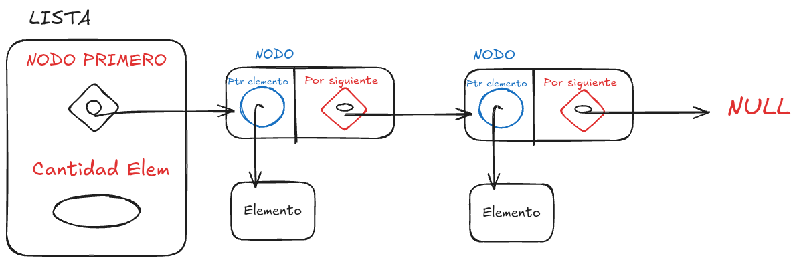
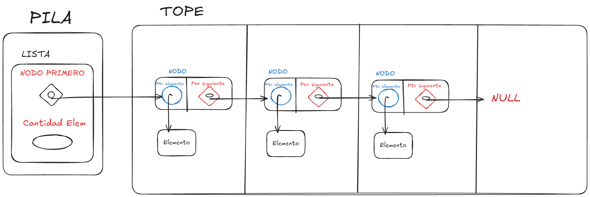
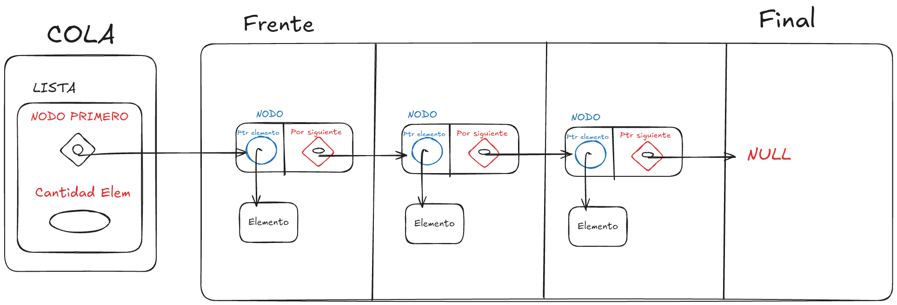

<div align="right">

</div>

# TDA LISTA


## Alumno: Nicolas Martin Guerrero- 112514 - nguerrero@fi.uba.ar // guerreronico81@gmail.com

- Para compilar:

```bash
gcc tp_lista.c src/*.c
```

- Para ejecutar:

```bash
./a.out pokedex.csv ';'
```

- Para ejecutar con valgrind:
```bash
valgrind ./a.out pokedex.csv ';'
```

---

##  Funcionamiento

El TDA principal de este trabajo es el TDA Lista, que es una lista simplemente enlazada que empieza con un `struct lista` que tiene la cantidad de elementos guardados y un puntero a un `NODO`. Ese nodo es el que almacena un elemento y un puntero al siguiente `NODO`.
Tanto el `struct lista` como cada `NODO` se inicializan con `malloc`.


Para el funcionamiento de las funciones de esta lista, necesito poder moverme dentro de la lista, nodo a nodo. Para lograr esto mismo, utilizo un puntero auxiliar que va cambiando de objetivo hasta llegar al punto deseado.
Por ejemplo, en `lista_agregar_al_final` muevo aux el nodo que en ptr_siguiente tiene `NULL`, ya que ese es el ultimo nodo.

En `lista_quitar_elemento` se sigue una idea similar, pero con la diferencia que ahora la indicacion de parar esta dada por la posicion que recive la funcion, entonces aux debe parar en el nodo de la posicion y otro puntero auxiliar (anterior) debe parar un nodo antes. Con los punteros bien posicionados, se puede quitar un nodo y enlazar al anterior.


Con esta logica de usar uno o varios punteros para modificar la lista, puedo hacer el resto de funciones, como borrar los nodos uno a uno o iterar todos los nodos.

Finalmente, tanto `PILA` como `COLA` son como wrapers de una lista que limitan como se agrega y saca nodos del TDA.

`Pila`  hace todo desde el tope, que decidi poner al inicio para siempre tener acceso facil.

<div align="center">

</div>

`Cola`  agrega en el final y saca desde el frente, decidi poner el frente al inicio para siempre tener acceso facil, y agregar al final ya es una funcion de Lista

<div align="center">

</div>


---

## Respuestas a las preguntas teóricas

### Qué es una lista/pila/cola? Explicar con diagramas.
Una lista es una cadena de elementos que pueden ser accedidos en cualquier orden, podes agarrar el primero, el ultimo o cualquiera del medio. 


### Explica y analiza las diferencias de complejidad entre las implementaciones de lista simplemente enlazada, doblemente enlazada y vector dinámico para las operaciones:
    Insertar/obtener/eliminar al inicio
    Insertar/obtener/eliminar al final
    Insertar/obtener/eliminar al medio
### Explica la complejidad de las operaciones implementadas en tu trabajo para la pila y la cola.
