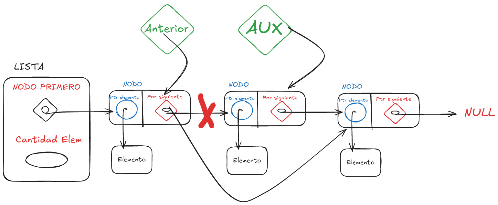

<div align="right">

</div>

# TDA LISTA


## Alumno: Nicolas Martin Guerrero- 112514 - nguerrero@fi.uba.ar // guerreronico81@gmail.com

- Para compilar:

```bash
gcc tp_lista.c src/*.c
```

- Para ejecutar:

```bash
./a.out pokedex.csv ';'
```

- Para ejecutar con valgrind:
```bash
valgrind ./a.out pokedex.csv ';'
```

---

##  Funcionamiento

El TDA principal de este trabajo es el TDA Lista, que es una lista simplemente enlazada que empieza con un `struct lista` que tiene la cantidad de elementos guardados y un puntero a un `NODO`. Ese nodo es el que almacena un elemento y un puntero al siguiente `NODO`.
Tanto el `struct lista` como cada `NODO` se inicializan con `malloc`.


Para el funcionamiento de las funciones de esta lista, necesito poder moverme dentro de la lista, nodo a nodo. Para lograr esto mismo, utilizo un puntero auxiliar que va cambiando de objetivo hasta llegar al punto deseado.
Por ejemplo, en `lista_agregar_al_final` muevo `aux` al nodo que en `ptr_siguiente` tiene `NULL`, ya que ese es el último nodo.

En `lista_quitar_elemento` se sigue una idea similar, pero con la diferencia de que ahora la indicación de parar está dada por la posición que recibe la función. Entonces, aux debe parar en el nodo de la posición y otro puntero auxiliar (anterior) debe detenerse un nodo antes. Con los punteros bien posicionados, se puede quitar un nodo y enlazar al anterior.


Con esta lógica de usar uno o varios punteros para modificar la lista, puedo hacer el resto de funciones, como borrar los nodos uno a uno o iterar sobre todos los nodos.

Finalmente, tanto `PILA` como `COLA` son como wrappers de una lista que limitan cómo se agregan y sacan nodos del TDA.

`Pila` hace todo desde el tope, que decidí poner al inicio para siempre tener acceso fácil.

<div align="center">

</div>

`Cola` agrega al final y saca desde el frente. 
Decidí poner el frente al inicio para siempre tener acceso fácil, y agregar al final ya es una función de Lista.
<div align="center">

</div>


---

## Respuestas a las preguntas teóricas

### Qué es una lista/pila/cola? Explicar con diagramas.
Una lista es una cadena de elementos que pueden ser accedidos en cualquier orden. Podés agarrar el primero, el último o cualquiera del medio. 


Una cola sigue siendo una cadena de elementos, pero solo se puede agregar en un extremo (Final) y solo se puede eliminar desde el otro extremo (Frente).


Una Pila también puede entenderse como una cadena de elementos, pero la Pila solo permite el acceso al elemento que está en el tope, entonces solo se puede agregar arriba del tope (azul) o sacar el elemento que está en el tope (rojo).
Lo que está tapado por amarillo es inaccesible.


### Explica y analiza las diferencias de complejidad entre las implementaciones de lista simplemente enlazada, doblemente enlazada y vector dinámico para las operaciones:
    Insertar/obtener/eliminar al inicio
    Insertar/obtener/eliminar al final
    Insertar/obtener/eliminar al medio
Las 3 implementaciones de lista tienen la misma complejidad para Insertar/obtener/eliminar al inicio. Es O(1) ya que las tres implementaciones tienen facil acceso al primer nodo, y si tienen que crearlo es un simple malloc que no mueve nada. O si tienen que eliminarlo al acceder al primer nodo tienen el puntero que apunta al siguiente.

Insertar/obtener/eliminar al final Es siempre O(n), como minimio,en todas las implementaciones, a menos de que ya tengan guardado un puntero al final
pero esto no aplica al vector dinamico. 

Ya que el Vector dinamico tiene que usar `realloc` para eliminar e insertar, llevando la complejidad a O(n) y si el vector dinamico tiene un puntero al final puede obtener con O(1).

Las listas enlazadas pueden ser O(1) si ya tienen un puntero que apunta al final, sino son O(n) los 2 tipos de lista.

Insertar/obtener/eliminar al medio es O(n) siempre para vector dinamico, porque tiene que usar realloc si no es obtener, y aun si es obtener es O(n) porque tiene que recorrer la lista en el peor caso.

Para las listas enlazadas la complejidad sigue siendo O(n) porque tienen que moverse por la lista, ya sea para Insertar/obtener/eliminar.

### Explica la complejidad de las operaciones implementadas en tu trabajo para la pila y la cola.

### cada una de estas funciones es O(1) `PILA`

size_t pila_cantidad(Pila *);

void *pila_tope(Pila *);

bool pila_apilar(Pila *, void *);

void *pila_desapilar(Pila *);

bool pila_esta_vacía(Pila *);

### O(n) `PILA`

void pila_destruir(Pila *);

void pila_destruir_todo(Pila *, void (*f)(void *));


### O(n) `COLA`

void cola_destruir(Cola *);

void cola_destruir_todo(Cola *, void (*f)(void *));

bool cola_encolar(Cola *, void *);

### cada una de estas funciones es O(1) `COLA`

size_t cola_cantidad(Cola *);

void *cola_frente(Cola *);


void *cola_desencolar(Cola *);

bool cola_esta_vacía(Cola *);

Tanto para Pila como para Cola, las funciones utilizan el resultado de una función de `Lista`. Los casos de `destruir` necesariamente deben recorrer todos los nodos, esto lo hace una función de lista y en la función de pila y cola solo son llamadas, así que, aunque no tengan ningún loop, la función que llaman sí lo tiene.

La `Pila` tiene como ventaja que todo es realizado en el tope, que es el primer nodo por ende siempre es O(1).

La `Cola` es O(1) siempre que se use el frente pero cuando hay que `encolar` es O(n) ya que hay que llegar al final.

Ambos Tda guardan la cantidad como dato asi que no hay que contar, por ende, O(1)
